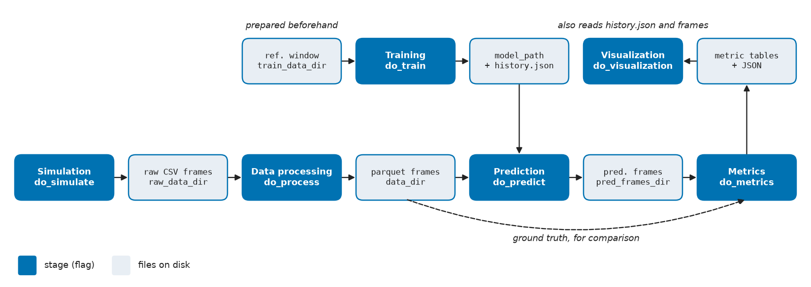

Choosing an entry point
=======================

The same code runs behind every entry point --
:class:`~bppm_dem_sm.config.ExperimentConfig` holds the settings and
:func:`~bppm_dem_sm.experiment_pipeline.run_experiment_pipeline` runs the
stages it enables.

.. list-table::
   :header-rows: 1
   :widths: 20 40 40

   * - Entry point
     - Use it when
     - Start at
   * - Command line
     - You want a reproducible run from a shell or a job script, driven by a
       JSON file or flags.
     - :doc:`cli`
   * - Python: the pipeline
     - You want the same run from your own script, plus access to the
       in-memory results (model, predictions, metric tables).
     - :doc:`python_pipeline`
   * - Python: stage by stage
     - You want one piece -- a metric, a plot, the SR term -- on your own
       frames, without running the pipeline around it.
     - :doc:`stages/index`

Every stage after training only needs files the earlier stages left on disk,
so you can mix entry points: train from the CLI, then score from Python.
:doc:`walkthroughs` shows complete studies both ways.

Pipeline stages
---------------

In run order, each gated by a ``do_*`` flag:

         parquet frames, prediction uses them with the trained model and writes
         predicted frames, metrics scores predictions against ground truth, and
         visualization renders the metric tables.
   :width: 100%

   Stages (dark) and the files they read and write (light). Training reads a
   short reference window you prepare beforehand.

.. list-table::
   :header-rows: 1
   :widths: 22 30 48

   * - Stage
     - Flag (default)
     - Reads -> writes
   * - Simulation
     - ``do_simulate`` (off)
     - YADE scenario script -> raw CSV frames
   * - Data processing
     - ``do_process`` (off)
     - ``raw_data_dir`` CSVs -> ``data_dir`` parquet frames
   * - Training
     - ``do_train`` (off)
     - ``train_data_dir`` -> ``model_path`` + ``<name>.history.json``
   * - Prediction
     - ``do_predict`` (on)
     - ``data_dir`` + model -> ``prediction.pred_out_dir``
   * - Metrics
     - ``do_metrics`` (on)
     - GT and predicted frames -> metric parquet/JSON next to each
   * - Visualization
     - ``do_visualization`` (on)
     - everything above -> figures and animation
