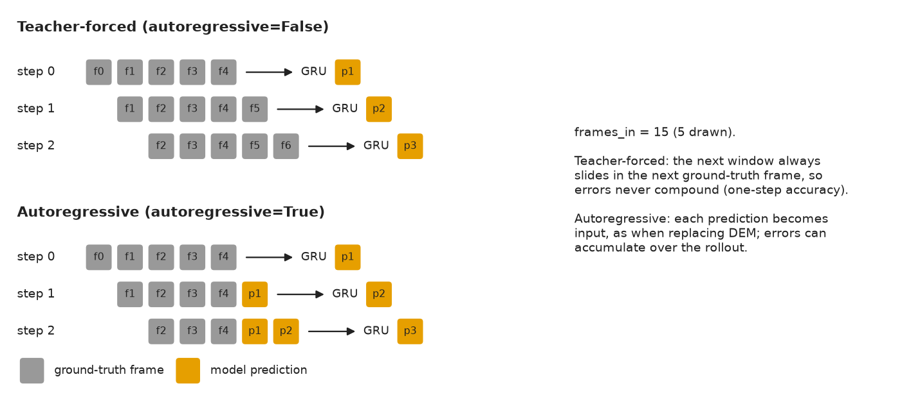

Surrogate model
===============

:mod:`bppm_dem_sm.model.rnn` builds, trains, loads, and runs the GRU that
predicts each particle's next ``(x, y, z)`` from its last ``frames_in``
steps of ``(x, y, z, r)``. TensorFlow is imported only when one of these
functions is called.

Building the network
--------------------

``Input(frames_in, n_features) -> GRU -> Dense(tanh) -> Dense(3)``,
compiled with Adam and MSE:

.. code-block:: python

   from bppm_dem_sm.model.rnn.architecture import build_model

   model = build_model(frames_in=15, n_features=4, gru_units=20, dense_units=15, learning_rate=0.01)
   model.summary()

Use it directly when fitting on your own ``(X, y)``, e.g. from
:doc:`data_processing`:

.. code-block:: python

   model.fit(X_train, y_train, validation_data=(X_val, y_val), epochs=5, batch_size=500)

Training and saving
-------------------

:func:`~bppm_dem_sm.model.rnn.training.train_and_save` is the ``do_train``
stage: it loads ``train_data_dir``, builds the dataset and the network from
``config.training``, fits, and writes ``model_path`` plus a
``<name>.history.json`` with the per-epoch ``loss`` / ``val_loss``:

.. code-block:: python

   from pathlib import Path
   from bppm_dem_sm import ExperimentConfig, TrainingOptions
   from bppm_dem_sm.model.rnn.training import train_and_save

   cfg = ExperimentConfig(
       model_path=Path("models/rnn_gru_sic_model.keras"),
       training=TrainingOptions(epochs=20, batch_size=500),
   )
   model, history = train_and_save(cfg)
   # models/rnn_gru_sic_model.keras
   # models/rnn_gru_sic_model.history.json

A ``model_path`` without the ``.keras`` suffix is saved with it added.

Loading a saved model
---------------------

Accepts ``.keras`` and ``.h5`` files, and legacy TensorFlow SavedModel
directories (wrapped so they expose the same ``predict``):

.. code-block:: python

   from bppm_dem_sm.model.rnn.loading import load_model

   model = load_model("models/rnn_gru_sic_model.keras")
   print(model.input_shape, model.output_shape)  # (None, 15, 4) (None, 3)

When the exact file is missing, the alternate suffixes and the bare
directory name are tried before raising ``FileNotFoundError``.

Predicting frames
-----------------

:func:`~bppm_dem_sm.model.rnn.prediction.predict_frames` is the
``do_predict`` stage. It seeds a window with ``frames_in`` ground-truth
frames starting at ``prediction.start_frame``, then predicts one frame per
step. It writes ``pred_frame_XXXXX.parquet`` files under
``prediction.pred_frames_dir`` and a combined
``prediction.pred_combined_parquet``, and returns the combined table:

.. code-block:: python

   from bppm_dem_sm import ExperimentConfig, PredictionOptions
   from bppm_dem_sm.model.rnn.prediction import predict_frames

   cfg = ExperimentConfig(prediction=PredictionOptions(start_frame=66))
   preds = predict_frames(cfg)  # loads cfg.model_path
   preds = predict_frames(cfg, model=model)  # or reuse a model already in memory

Teacher-forced vs. autoregressive
~~~~~~~~~~~~~~~~~~~~~~~~~~~~~~~~~

With ``autoregressive=False`` (default), every step slides the next
**ground-truth** frame into the window, so errors never accumulate: this
measures one-step accuracy. With ``autoregressive=True``, the model's own
``(x, y, z)`` is fed back in, which is how the surrogate would replace DEM:

         only ground-truth frames; autoregressive windows fill up with the
         model's own predictions.
   :width: 100%

   Where each step's newest input frame comes from, in the two modes.

.. code-block:: python

   cfg_ar = cfg.with_overrides(autoregressive=True, predict_until_end=False, max_steps=50)
   preds_ar = predict_frames(cfg_ar, model=model)

``predict_until_end=True`` predicts through the last frame in ``data_dir``;
otherwise ``max_steps`` frames are predicted. With ``stochastic.enabled``,
every step also adds the SR displacement -- the local velocity fluctuation
the GRU's deterministic output leaves out; see :doc:`sr`.
