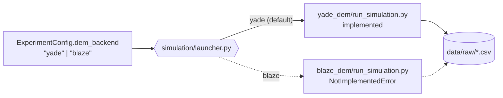

# Proposed Package Structure

A by-concern reorganization of `bppm_dem_sm/`, starting from the `simulation`
split you specified, then applying the same one-concern-per-module logic to
the rest of the package. Grounded in the current code (functions named below
all exist today); nothing here is invented.

## 1. Simulation

Extended from your requested shape now that a second DEM engine is planned:
YADE today, **BlazeDEM** later, run interchangeably. `sim_functions.py`
(995 lines, ~30 functions) is entirely YADE code, so under this backend
split it becomes the *YADE backend's* implementation, not shared code.
`launcher.py` is the one file every backend genuinely has in common (it
subprocesses out to whichever executable the run needs and never imports a
DEM engine's own Python API) and stays where it is. Everything else —
`materials`/`stl`/`engines` absorbing `sim_functions.py`'s setup-side
functions, plus the four concern modules absorbing what it does *after*
setup (loading a charge, running it, saving it, inspecting it), plus
`simulation.py` renamed `run_simulation.py` as before — moves one level
down into a new `yade_dem/` subpackage. `blaze_dem/` is added alongside it:
same file names, same function signatures, `NotImplementedError` bodies
until there's real BlazeDEM code behind them — see [§4](#4-running-everything-end-to-end).
Which backend a run actually uses is a new `ExperimentConfig.dem_backend`
field (`"yade"` | `"blaze"`), and every DEM constant both backends read —
`MATERIALS`, `SAGMILL_STL_PATH`, `ROCK_COUNT`, etc. — stays centralized in
`config.py` as before, now made backend-agnostic; see
[§5](#5-config-stays-centralized) for both.

```
simulation/
├── launcher.py                     # shared — subprocess bridge; dispatches on ExperimentConfig.dem_backend
├── yade_dem/                         # YADE backend (implemented)
│   ├── __init__.py
│   ├── run_simulation.py              # renamed from simulation.py — YADE scenario orchestrator (run())
│   ├── materials.py                     # steel/rock definitions + contact interactions
│   ├── stl.py                             # mill geometry: STL loading + slice measurements
│   ├── engines.py                           # contact model, dt, damping, rotation, force-balance settling
│   ├── particles.py                           # particle loading + ingress (charge generation)
│   ├── state.py                                 # save/load particle positions (CSV snapshots)
│   ├── capture.py                                 # frame recording during a run
│   └── diagnostics.py                               # overlap checks, particle inventory
└── blaze_dem/                        # BlazeDEM backend (placeholder — no implementation yet)
    ├── __init__.py                     # each file below: same public names as its yade_dem
    ├── run_simulation.py                 # counterpart, bodies raising NotImplementedError
    ├── materials.py                        # until real BlazeDEM code lands
    ├── stl.py
    ├── engines.py
    ├── particles.py
    ├── state.py
    ├── capture.py
    └── diagnostics.py
```

| `yade_dem/` module | Functions it absorbs (from `sim_functions.py` unless noted) |
|---|---|
| `materials.py` | `initialize_simulation_materials`, `_mat_label`; reads `config.MATERIALS` and calls `config.build_yade_material_interactions()` |
| `stl.py` | `initialize_sag_mill_slice`, `_obtain_sag_mill_slice_measurements`, `_add_sag_mill_slice_caps`, `createBox`, `createFunnel`, `chord_box_3d`, `get_surface_y`; reads `config.SAGMILL_STL_PATH` |
| `engines.py` | `initialize_engines`, `set_dt`, `set_gravity_damping`, `rotate_mill_indefinitely`, `rotate_mill_by_degrees`, `rotate_mill_by_time`, `_get_rotation_engine`, `run_until_forces_balanced`, `_balance_check` |
| `particles.py` | `load_rock_particles`, `load_ball_particles`, `load_all_particles`, `ingress_random`, `ingress_segregated`; reads `config.ROCK_COUNT`, `config.ROCK_DIAM_M`, `config.BALL_COUNT`, `config.BALL_DIAM_M` |
| `state.py` | `save_particle_positions`, `load_particle_positions`, `settle_balance_save` |
| `capture.py` | `start_frame_capture`, `_save_sphere_frame` |
| `diagnostics.py` | `check_overlaps`, `get_particle_inventory` |

Net effect: `sim_functions.py` — a 995-line grab-bag — disappears into seven
focused modules under `yade_dem/`, none over ~200 lines, each independently
testable (the existing `tests/simulation/test_sim_functions.py` splits
along exactly these lines: `_mat_label` → `materials`, `chord_box_3d` →
`stl`; it moves to `tests/simulation/yade_dem/` alongside them).
`blaze_dem/`'s eight stub files carry no tests yet — there's nothing to
assert beyond "raises `NotImplementedError`," which isn't worth a suite
until real behavior exists.

### Why two subpackages, not per-backend branches in shared files?

You asked which is more standard: `yade_dem/`/`blaze_dem/` as separate
subpackages, or keeping one `materials.py`/`stl.py`/etc. per concern and
branching on the backend inside each. **Subpackages** — this is the
established "pluggable backend" pattern for scientific/ML software where
several engines solve the same physics through unrelated APIs: Keras's
`keras/backend/{tensorflow,torch,jax}`, ASE's `ase/calculators/<code>/`
(one adapter per DFT/quantum-chemistry engine behind a shared
`Calculator` interface), pyiron's per-simulation-code job classes. All of
them pick "one subpackage per backend, same method names across backends"
over branching inside shared files, for the same reason it applies here:

- YADE's Boost.Python object model (`O.bodies`, `O.materials`, YADE's own
  `MatchMaker`) and BlazeDEM's — whatever that turns out to be — share no
  implementation-level code, only the *conceptual* contract: "something
  called `initialize_simulation_materials`," "something called
  `ingress_random`." Branching inside each of the eight files
  (`if backend == "yade": ... else: ...`) would double every one of them
  for zero shared logic — reintroducing the same grab-bag problem this
  proposal's whole point was to split `sim_functions.py` out of.
- `launcher.py` is the one file that's *genuinely* backend-shared (a
  subprocess bridge doesn't care which engine's Python API is on the other
  side of the process boundary, only which executable/script to invoke),
  so it correctly stays outside both subpackages, one level up — extending
  its own current docstring promise ("nothing in this subpackage is
  importable ... except `launcher`, which never imports yade itself") to
  "or blaze."
- Cost: more files total (mirrored names across two directories). Same
  tradeoff already made splitting `sim_functions.py` into seven modules —
  small, single-purpose, independently testable beats one large file
  branching on every concern.

## 2. Rest of the package, same fashion

### `data_processing/`
Already close to one-concern-per-file; the one seam worth cutting is inside
`frames.py`, which currently mixes *loading* frames off disk with
*constructing* the supervised-learning arrays from them. It also gains the
`run_*.py` orchestrator it was missing, so it matches `metrics/` and
`visualization/` and can be gated as its own pipeline stage — see
[§4](#4-running-everything-end-to-end).

```
data_processing/
├── convert.py           # was csv_to_parquet.py — convert_csv_file_to_parquet, convert_folder_csv_to_parquet
├── frames.py              # sorted_frame_files, load_frame, load_frames_stacked
├── dataset.py               # build_supervised_dataset, train_test_split
├── integrity.py                # particle_radius_counts_per_file, report_particle_integrity
└── run_data_processing.py        # new — orchestrator: raw CSVs -> parquet + integrity check
```

`run_data_processing.py` is new code, not a rename: a `process_frames(config)`
function that calls `convert.convert_folder_csv_to_parquet` on
`config.raw_data_dir` (new field) → `config.data_dir`, then runs
`integrity.report_particle_integrity` on the result as a sanity gate before
training/prediction ever touch the data — the same "one call returns
everything for this stage" shape as `compute_metrics(config)` and
`generate_visualizations(config)`. `frames.py`/`dataset.py` keep being
imported piecemeal by `model/rnn/training.py`, `model/rnn/prediction.py`,
and `metrics/run_metrics.py` for in-memory array building — that part of
`data_processing` stays library code, only the CSV→parquet conversion step
becomes an explicit, gated stage.

### `model/`
This package holds the two components of the paper's RNNSR method: the GRU
**RNN** surrogate (deterministic prediction) and the **SR** stochastic term
applied after it. `training.py` currently mixes model *architecture* with
the *training loop*, and `prediction.py` mixes model *loading* with the
*sliding-window prediction loop* — split each along that seam. Since all
four RNN modules are tightly related but SR is a distinct component applied
*on top of* the RNN's output, group the RNN files under their own
subpackage rather than prefixing filenames (`rnn_architecture.py`, etc.) —
matches how `simulation/`, `metrics/`, and `visualization/` are already
subpackages, and keeps `model/` importable as "the surrogate," with `rnn`
as one clearly-named part of it (`from bppm_dem_sm.model.rnn import
training`, `from bppm_dem_sm.model import sr`). `stochastic_motion.py` is
renamed to `sr.py` to match: it's the SR half of "RNNSR" the same way `rnn/`
is the RNN half, and the paper itself, `ExperimentConfig`
(`StochasticOptions`), and the metrics/plots all already call it "SR" /
"stochastic," never "stochastic motion" — the module name was the odd one
out.

```
model/
├── rnn/
│   ├── __init__.py
│   ├── architecture.py     # was part of training.py — build_model (GRU → Dense)
│   ├── training.py           # train_and_save
│   ├── loading.py              # was part of prediction.py — load_model, _resolve_model_path, _SavedModelWrapper
│   └── prediction.py             # predict_frames (sliding window)
└── sr.py                           # renamed from stochastic_motion.py — SR velocity perturbation, applied after rnn.prediction (Kishida et al. 2025)
```

Everything that names the old module follows: `model/rnn/prediction.py`'s
`from . import stochastic_motion` → `from .. import sr`;
`experiment_pipeline.py`'s import of `model.stochastic_motion` (if any is
added later) → `model.sr`; and the internal names it exposes (`VelocityStdField`,
`build_velocity_std_field`, `build_velocity_std_field_from_config`,
`sample_stochastic_displacement`) are unaffected — only the file/module
path changes, not the API.

`rnn/training.py` also changes behavior, not just location: `train_and_save`
currently plots the loss curve itself, inline, from the `History` object
`model.fit()` returns — an object that only exists in memory for that one
process. It stops doing that. Instead it persists `history.history` (the
plain `{"loss": [...], "val_loss": [...]}` dict) to
`models/<model_name>.history.json`, right next to the `.keras` file it
already saves, and returns the same `(model, history)` as before. See
[§6](#6-persist-everywhere-render-only-in-visualization) for why, and what
this implies for `metrics/` too.

### `metrics/`
Already one-file-per-metric; `compute_computing_speed` is presently bolted
onto the `run_metrics.py` orchestrator even though it's an unrelated
concern (wall-clock comparison, not a particle-frame metric) — pull it out:

```
metrics/
├── lacey_mixing_index.py
├── segregation_profile.py
├── velocity_metrics.py
├── computing_speed.py    # new — was compute_computing_speed in run_metrics.py
└── run_metrics.py          # orchestrator: compute_metrics + per-directory compute_* helpers
```

`run_metrics.py` also gains a persistence step it's currently missing for
two of its four results. `compute_lacey_over_dir` and
`compute_profile_over_dir` already write their summaries to parquet inside
`frames_dir` (`lacey_over_time[_pred].parquet`,
`segregation_profile_{radial,axial}[_pred].parquet`); this proposal adds
the matching writes for the other two, which today only return a plain
dict that dies with the process: `compute_velocity_and_granular_temperature`
gains a write to `velocity_speed.json` + `granular_temperature.parquet`
(also inside `frames_dir`), and `compute_computing_speed` gains a write to
`reports/computing_speed.json`. Same reasoning as the `history.json` fix
above — see [§6](#6-persist-everywhere-render-only-in-visualization).

### `visualization/`
Already one-file-per-plot-type. The one thing worth flagging (not a rename,
a dedup): `animate_particles.py` is a **standalone** particle animator whose
own docstring points at `run_visualization.animate_frames` as "the
pipeline-integrated variant" — i.e. two implementations of the same
animation. Worth folding `animate_particles.py`'s logic into
`run_visualization.py` (or vice versa) rather than maintaining both.

```
visualization/
├── cell_grid.py            # single-frame scatter + Lacey grid overlay
├── training_curves.py        # GRU loss curves — now reads history.json, doesn't take a live History
├── metrics_plots.py            # GT vs. surrogate comparison plots
├── run_visualization.py          # pipeline entry point: animate_frames, plot_frame_grid, generate_visualizations, plot_training_history
└── animate_particles.py            # ⚠ near-duplicate of animate_frames — candidate to merge
```

`training_curves.py` **stays here** — last revision I suggested moving it
into `model/rnn/`, on the reasoning that it's the one plot tied to a
single stage. On reflection that's the wrong axis: every file in this
directory is "tied to a single stage" in the sense that it renders an
artifact some other stage produced (`cell_grid.py` needs a GT frame from
Data Processing, `animate_particles`/`run_visualization.animate_frames`
needs a PRED dir from Model, `metrics_plots.py` needs the parquet/JSON
`metrics/` now writes) — that's not disqualifying, it's the whole point of
`visualization/`. What actually made `training_curves.py` different wasn't
its *location*, it was that its input wasn't a file at all — fixed above.
Once `plot_training_history` reads `models/<model_name>.history.json`
instead of taking a live `History` object, it fits the same shape as every
other file here and has no reason to move. `run_visualization.py` picks it
up alongside its other plotting calls; see
[§6](#6-persist-everywhere-render-only-in-visualization).

### Top level (`cli.py`, `config.py`, `experiment_pipeline.py`, `progress.py`, `tf_quiet.py`)
These are cross-cutting (CLI parsing, orchestration, config, progress bars,
TF log suppression) rather than pipeline stages, so they don't get a
concern-per-file split the same way — they stay flat at package root.
`config.py` stays exactly what it is today: **one file, everything you can
configure, in one place** — see [§5](#5-config-stays-centralized). Its
docstring should be widened accordingly (currently claims "Configuration
and path resolution for the RNN surrogate pipeline," which is already
inaccurate today since it also holds DEM constants — the fix is to update
the docstring to match reality, not move the code to match the docstring).
`pipeline.py` is renamed to `experiment_pipeline.py` and changes more
substantially — see [§4](#4-running-everything-end-to-end) and
[§5](#5-config-stays-centralized).

## 3. Stage inputs / outputs

What concretely comes out of each stage, and where it lands on disk. Paths
are relative to `REPO_ROOT`; dataset/model names are the project's current
defaults (`config.py`).

| Stage | Reads | Produces | Location |
|---|---|---|---|
| **Simulation** (`yade_dem/run_simulation.py`, selected via `dem_backend="yade"`; `blaze_dem/` planned) | `sag_mill_40ft_m.stl`; material params (steel ρ=7850, rock ρ=2650, Young's/Poisson/friction); charge spec (19 888 rock @ ⌀0.06985 m, 4 696 steel @ ⌀0.1397 m) | Per-timestep particle-state CSVs (`state.save_particle_positions`); optional settled-state snapshot (e.g. `rmic_nopf_settled.csv`) | `data/raw/<run>/frame_*.csv` |
| **Data Processing** (`run_data_processing.py`) | Raw CSV frames | Parquet frames (`convert.py`); integrity report (`integrity.py`); in-memory `[T,N,3]` position / `[T,N,1]` radius tensors → sliding-window `X:[n,15,4]`, `y:[n,3]` arrays (built later, not persisted) | `data/processed/sic_dataset_20s_dt0p0001_parquet/frame_*.parquet` (+ separate `sic_training_dataset_3s_4s_parquet` for training) |
| **Model — Training** (`model/rnn/training.py`) | Parquet frames from `train_data_dir` | Saved GRU model; loss-curve history — no plot rendered here anymore | `models/rnn_gru_sic_model.keras` + `models/rnn_gru_sic_model.history.json` |
| **Model — Prediction** (`model/rnn/prediction.py`) | Parquet frames from `data_dir`; trained model; optional SR `sigma_v(x)` field from `model/sr.py` (estimated from `train_data_dir`) | One `pred_frame_XXXXX.parquet` per predicted step; combined table | `data/interim/rnn_predictions/pred_frames/pred_frame_*.parquet` + `data/interim/rnn_predictions/predictions_all.parquet` |
| **Metrics** | GT parquet frames (`data_dir`) + PRED parquet frames (`pred_frames_dir`) | Lacey mixing-index summary; radial/axial segregation profile; velocity distribution; granular temperature; dimensionless computing-speed — all persisted now, no plot rendered here | `lacey_over_time[_pred].parquet`, `segregation_profile_{radial,axial}[_pred].parquet`, `velocity_speed.json` + `granular_temperature.parquet` (all written into each frames directory); `reports/computing_speed.json` |
| **Visualization** | `history.json`; the metrics files above; GT/PRED parquet frames — every render call lives here now, see [§6](#6-persist-everywhere-render-only-in-visualization) | Loss-curve figure; 5 GT-vs-surrogate comparison PNGs; cell-grid frame PNG; prediction animation (MP4, falls back to GIF without ffmpeg) | `reports/figures/*.png`; `data/interim/figures/cell_grid_frame.png` + `pred_animation.mp4` |

### Diagram

```mermaid
flowchart LR
    subgraph SIM["simulation/yade_dem/run_simulation.py<br/>(default backend, needs yade)"]
        direction TB
        MAT["materials.py"]
        STLM["stl.py"]
        ENG["engines.py"]
        PART["particles.py"]
    end

    RAW[("data/raw/*.csv<br/>per-timestep frames")]
    SIM -->|"state.save_particle_positions()<br/>via launcher.launch_simulation()"| RAW

    RAW --> DPROC["data_processing/<br/>run_data_processing.py"]
    DPROC -->|"convert.py"| PROC[("data/processed/&lt;dataset&gt;/<br/>frame_*.parquet")]
    DPROC -.->|"integrity.py"| INTEG[["integrity report"]]

    PROC -->|"frames.py + dataset.py<br/>build_supervised_dataset"| ARR[["X: [n,15,4], y: [n,3]<br/>in-memory arrays"]]

    ARR --> TRAIN["model/rnn/training.py<br/>train_and_save"]
    TRAIN --> MODEL[("models/rnn_gru_sic_model.keras")]
    TRAIN --> HISTFILE[("models/rnn_gru_sic_model<br/>.history.json")]
    HISTFILE --> VIZ

    PROC -->|"model/rnn/prediction.py<br/>predict_frames"| PRED[("data/interim/rnn_predictions/<br/>pred_frame_*.parquet + predictions_all.parquet")]
    MODEL --> PRED
    STOCH["model/sr.py<br/>sigma_v(x) from train_data_dir"] -.optional SR term.-> PRED

    PROC --> METRICS["metrics/run_metrics.py"]
    PRED --> METRICS
    METRICS -->|"lacey_mixing_index.py"| LACEY[("lacey_over_time[_pred].parquet")]
    METRICS -->|"segregation_profile.py"| SEG[("segregation_profile_radial/axial[_pred].parquet")]
    METRICS -->|"velocity_metrics.py"| VEL[("velocity_speed.json +<br/>granular_temperature.parquet")]
    METRICS -->|"computing_speed.py"| SPEED[("reports/computing_speed.json")]

    LACEY --> VIZ
    SEG --> VIZ
    VEL --> VIZ
    SPEED --> VIZ["metrics_plots.py +<br/>run_visualization.py<br/>(all rendering happens here — §6)"]
    PROC --> VIZ
    PRED --> VIZ

    VIZ --> FIGS[("reports/figures/*.png")]
    VIZ --> ANIM[("data/interim/figures/<br/>pred_animation.mp4")]
```



### Backend dispatch (feeds into the `SIM` box above)



## 4. Running everything end-to-end

Today, `pipeline.py` (renamed `experiment_pipeline.py` under this
proposal — see [§5](#5-config-stays-centralized)) only spans four of the
six stages: `do_train`,
`do_predict`, `do_metrics`, `do_visualization`. Simulation and data
processing sit outside it entirely — `cli.py`'s `dem-sim` subcommand
launches `run_simulation.py` on its own, and nothing calls
`data_processing` as a stage at all. Every module above now has a matching
`run_<subpackage>.py`, so the natural next step is closing that gap: add
`do_simulate` and `do_process` to `ExperimentConfig`, both `False` by default
(matching `do_train`), so a single `run_experiment_pipeline(...)` call can go all the
way from an empty DEM charge to comparison plots, or run any subset exactly
as today.

```
do_simulate → do_process → do_train → do_predict → do_metrics → do_visualization
```

Two things make `do_simulate` different from the other five gates —
compounded now by `dem_backend` choosing *which* simulation module runs
(see [§1](#1-simulation)):

- **Different interpreter (YADE backend).** `yade_dem/run_simulation.py`
  runs under YADE's patched Python, not this package's own venv —
  `experiment_pipeline.py` can't `import` it the way it imports
  `model.rnn.training` or `metrics.run_metrics`. With `dem_backend="yade"`,
  `do_simulate` has to go through
  `simulation.launcher.launch_simulation()`, which subprocesses out to the
  `yade` executable, same as `cli.py`'s `dem-sim` subcommand does today.
  BlazeDEM's execution model isn't known yet (own interpreter? a plain
  binary? bindings importable from this venv?) — `launcher.py`'s dispatch
  for `dem_backend="blaze"` is a placeholder until that's decided.
- **Optional dependency.** YADE isn't a pip package; it's a separate
  install. `experiment_pipeline.py` should check
  `simulation.launcher.find_yade_executable()` before attempting
  `do_simulate` with `dem_backend="yade"`, and raise the same clear
  `FileNotFoundError` that `launch_simulation()` already raises when
  `yade` isn't on `PATH` — so "run everything" fails fast and legibly on a
  machine without YADE, instead of partway through with an import error.
  `dem_backend="blaze"` fails just as fast today, for a different reason:
  every function in `blaze_dem/` still just raises `NotImplementedError`.
  Every other stage (`do_process` through `do_visualization`) has no such
  external dependency and runs on the plain TensorFlow/pandas venv exactly
  as it does today.

`do_process` is a normal in-venv stage like the rest: `experiment_pipeline.py` calls
`data_processing.run_data_processing.process_frames(config)` directly, no
subprocess involved — it only needs to exist as a *toggle* because you
often already have parquet frames on disk and don't want to reconvert them
on every run, same reasoning as why `do_train` defaults `False` (you don't
retrain on every predict/metrics/visualize run either).

## 5. Config stays centralized

You asked to keep every knob in `config.py` rather than splitting it up by
subpackage, to avoid having to hunt across the repo to change a setting.
That reverses the one part of the earlier revision that moved DEM
constants out — `MATERIALS`, `SAGMILL_STL_PATH`,
`ROCK_COUNT`/`ROCK_DIAM_M`/`BALL_COUNT`/`BALL_DIAM_M` all **stay
module-level constants in `config.py`**, exactly where they are today.
What changes is only that `simulation/yade_dem/materials.py`, `stl.py`,
and `particles.py` (and, once it exists, `blaze_dem/`'s equivalents)
*read* them from there (`from ... import config`) instead of defining or
receiving them locally — same as `model/rnn/training.py` already imports
`PipelineConfig` from `config.py` today. One file, every setting; the
backend subpackages are consumers, not owners, of configuration.

Two tiers stay distinct *within* that one file, because they're genuinely
different kinds of setting, not because they live in different places:

- **Plain module constants** (paths, `MATERIALS`, particle counts/diameters,
  `SAGMILL_STL_PATH`) — hardcoded values, no CLI flag, no JSON key, edited
  directly in `config.py`. This is how the DEM side is configured today,
  and this proposal doesn't change that behavior, only that the code
  reading them moves, and that they're now written to be read by *any*
  backend rather than assuming YADE — see the subsection right below.
- **`ExperimentConfig`** (renamed from `PipelineConfig` — see below) — the
  dataclass tree with `to_dict`/`from_dict`/`from_json`/`with_overrides`,
  drivable from Python, JSON (`configs/pipeline_example.json`), or `cli.py`
  flags, gaining `do_simulate`, `do_process`, `raw_data_dir` per §4, and
  now `dem_backend` per the subsection below.

### Simulation configs: shared vs. backend-specific

Everything DEM-related in `config.py` splits into three regions —
agnostic data every backend reads, then one subsection per backend for the
glue code that turns that data into *that backend's* objects. Concretely
(illustrative, not final code):

```python
# --- DEM simulation: shared / backend-agnostic ---
DEM_BACKENDS = ("yade", "blaze")

SAGMILL_STL_PATH = "sag_mill_40ft_m.stl"
ROCK_COUNT = 19888
ROCK_DIAM_M = 0.06985
BALL_COUNT = 4696
BALL_DIAM_M = 0.1397

MATERIALS = {
    "steel": {"density": 7850, "young": 155709722558.42664,
              "poisson": 0.292, "friction_angle": math.atan(0.5), "label": "steel"},
    "rock":  {"density": 2650, "young": 13468135026.041664,
              "poisson": 0.25,  "friction_angle": math.atan(0.5), "label": "rock"},
}

RESTITUTION_COEFFICIENTS = {
    ("steel", "steel"): 0.8,
    ("steel", "rock"):  0.5,
    ("rock",  "rock"):  0.3,
}

# --- YADE DEM specific ---
def build_yade_material_interactions():
    """Builds a YADE MatchMaker from RESTITUTION_COEFFICIENTS. Needs yade."""
    from yade import MatchMaker
    ...

# --- BlazeDEM specific ---
# placeholder -- no BlazeDEM fields yet. Reserved for backend-specific
# settings (GPU device index, solver tolerances, contact model variant,
# etc.) once BlazeDEM support lands.
def build_blaze_material_interactions():
    raise NotImplementedError("BlazeDEM backend not yet implemented")
```

Two things had to change for the shared block to actually be agnostic,
not just relabeled:

- **`build_material_interactions()` was YADE-only code masquerading as
  shared config** — it `import`s `yade.MatchMaker` and returns a
  YADE-specific object, so it can't stay in the shared section at all.
  Split it into data (`RESTITUTION_COEFFICIENTS`, three plain pairs — a
  format any backend can consume) and construction
  (`build_yade_material_interactions()`, moved to the YADE subsection,
  reading `RESTITUTION_COEFFICIENTS` to build the `MatchMaker`).
  BlazeDEM's equivalent constructor goes in the BlazeDEM subsection once
  it exists.
- **`MATERIALS`'s `frictionAngle` key is renamed `friction_angle`** —
  camelCase there was a direct copy of YADE's own parameter name
  (`FrictMat.frictionAngle`), which is a YADE-ism leaking into supposedly
  shared data. Renamed to match this project's snake_case convention
  everywhere else; `yade_dem/materials.py` maps it back to whatever YADE's
  API expects, the same translation job it already does for every other
  field.

`ExperimentConfig` gains one new core field, alongside `do_simulate`:

- **`dem_backend: str = "yade"`** — which DEM engine `do_simulate` invokes.
  This is the one DEM-related setting promoted into the override
  machinery now rather than deferred (see below), because it's inherently
  a per-run *choice*, not a fixed physical constant like `ROCK_COUNT` —
  the same reason `do_train`/`do_predict`/etc. are dataclass fields and
  not plain constants. `cli.py` exposes it as `--dem-backend {yade,blaze}`
  on both the `dem-sim` subcommand and the full pipeline; JSON configs
  gain an optional `"dem_backend"` key, defaulting to `"yade"` when
  omitted so `configs/pipeline_example.json` doesn't need updating.

If you later want the *rest* of the DEM parameters overridable the same
way (a CLI flag for `--rock-count`, a JSON key for mill geometry), that
still means promoting them into `ExperimentConfig` as a new options group
(e.g. `DemOptions`) — a bigger, separate change, deferred exactly as
before. `dem_backend` is the one exception because "which backend" isn't
optional to expose once two exist.

### Renaming `PipelineConfig`

"Pipeline" described the class well when it only gated
train/predict/metrics/visualization — four sequential ML steps. Once it
also gates `do_simulate` (a physics simulation with material properties and
mill geometry, not a data transform) and `do_process`, "pipeline" starts
undershooting what the object actually represents: the full configuration
of one reproducible run of the study, spanning both the DEM and ML halves
of the project. It isn't wrong — the six stages genuinely do run as a
pipeline — but it reads as if it only configures the ML side, the same
mismatch `config.py`'s own docstring has today.

**Recommendation: rename `PipelineConfig` → `ExperimentConfig`.** This
project is a reproduction of one published method (Kishida et al. 2025's
RNNSR surrogate) end to end — DEM ground truth through surrogate
validation — and "experiment config" is the standard term in research-code
repos for exactly that: everything needed to reproduce one run of a study,
not just one algorithm's hyperparameters. It also reads naturally at every
stage, DEM included ("this experiment's mill geometry," not "this
pipeline's mill geometry").

Alternative considered: `RunConfig` (used by tools like W&B/MLflow) — more
neutral, slightly less specific than `ExperimentConfig` about *why* you're
configuring a run. Either is a real improvement over `PipelineConfig`;
`ExperimentConfig` was chosen for this proposal because it matches the
project's own framing as a paper reproduction.

### Renaming `pipeline.py` / `run_pipeline()`

Per your ask to keep this glanceable — the module and file names should
say what they are without opening the file — `pipeline.py` and
`run_pipeline()` follow `ExperimentConfig` rather than being left as the
one place still saying "pipeline" on its own:

| Was | Becomes |
|---|---|
| `bppm_dem_sm/pipeline.py` | `bppm_dem_sm/experiment_pipeline.py` |
| `run_pipeline(config, **overrides)` | `run_experiment_pipeline(config, **overrides)` |

Applied throughout this doc (the six-stage orchestrator in
[§4](#4-running-everything-end-to-end), the top-level file listing, and
every other place `pipeline.py` was named above). `__main__.py` and
`cli.py`'s `ml-pipeline` subcommand update their
`from .pipeline import run_pipeline` to
`from .experiment_pipeline import run_experiment_pipeline` accordingly.
Nothing internal to the module changes — same stages, same
`ExperimentConfig` argument, same returned artifacts dict — only the name
you'd `import` or see in a directory listing.

## 6. Persist everywhere, render only in Visualization

You asked whether every stage should render its own output as it goes, or
whether output should be persisted per stage and rendered centrally at the
end. **Persist at every stage; render only in the Visualization stage.**
Not a coin flip between two equally reasonable styles — it's already the
dominant pattern in this codebase, and the two places that don't follow it
are bugs in waiting, not stylistic choices:

- **Training curves are entirely unrecoverable today.** `train_and_save`
  builds a Keras `History` object, plots it *inline, in the same function
  call*, and returns it — nothing about it reaches disk. Run
  `do_train=True, do_visualization=False` today, and the loss curve is
  gone the moment the process exits; there's no way to look at it later
  without retraining. That's the gap you asked about, and it's fixed by
  [§2's `model/` change](#model) above: `history.json` persisted next to
  the `.keras` file, `training_curves.py`'s `plot_training_history` reads
  that file instead of a live object.
- **The five metrics-comparison plots are gated by the wrong flag.** I
  checked `pipeline.py` directly: `metrics_plots.plot_lacey_comparison`
  and its four siblings are called from *inside* the `do_metrics` block —
  gated on `viz.show_plots or viz.save_figures`, not on `do_visualization`
  at all. `do_metrics=True, do_visualization=False` still renders plots
  today; `do_metrics=True, do_visualization=True` with metrics loaded from
  a *previous* run (no `do_metrics` this time) renders nothing, because
  the plot calls need the live `metrics` dict `compute_metrics` just
  returned, not a file. This proposal moves those five calls into the
  `do_visualization` block, where `run_visualization.generate_visualizations`
  already lives, and has them read the parquet/JSON `metrics/` now
  writes — the same fix as training curves, just for five call sites
  instead of one. `velocity_gt`/`velocity_pred` and `computing_speed`
  needed a persistence step added first (per [§2's `metrics/`
  change](#metrics)) because, unlike Lacey and the segregation profile,
  they were never written to disk at all — only ever passed as an
  in-memory dict from `compute_metrics` to the plot calls sitting right
  next to it in the same function.

The rule this leaves you with: **`do_train`, `do_process`, `do_predict`,
and `do_metrics` only ever compute and persist — none of them call
`plt.show()`, `fig.savefig()`, or anything in `visualization/`.
`do_visualization` is the only stage that renders, and everything it
renders it reads from disk** (or from an in-memory result *also* just
computed in the same call, when that's cheaper — but it must be able to
read the file too, so a later `do_visualization`-only run works without
re-running the stage that produced the data). Benefits, beyond fixing the
two gaps above:

- Every stage keeps the property the rest of this proposal already gives
  `run_simulation.py`, `run_data_processing.py`, `run_metrics.py`: fully
  re-runnable on its own, because its output is a file, not a Python
  object that dies with the process.
- Replotting with different `VisualizationOptions` (a different `plane`,
  `marker_size`, `fps`, or just re-running with `save_figures=True` after
  an interactive `show_plots=True` session) never requires re-simulating,
  re-training, re-predicting, or re-computing metrics — only re-reading
  the files those stages already left behind.
- Compute-heavy stages stop needing to know anything about rendering.
  `train_and_save` currently takes a `plot_history` argument and reads
  `config.visualization.show_plots` — a training function that knows about
  plot display settings. After this change it takes neither; rendering
  config only matters to `run_visualization.py`.

One deliberate exception, **not** covered by this rule: the YADE Qt viewer
(`qt.Controller()`/`qt.View()`) that `yade_dem/run_simulation.py` opens
mid-run. That's not a plot of a persisted artifact — it's a live view of
the simulation *as it's running*, inside YADE's own process. There's
nothing to defer to `do_visualization`: by the time a frame exists on
disk, the view showing it live has already moved on. It stays exactly
where it is.
