# Proposed Package Structure

A by-concern reorganization of `bppm_dem_sm/`, starting from the `simulation`
split you specified, then applying the same one-concern-per-module logic to
the rest of the package. Grounded in the current code (functions named below
all exist today); nothing here is invented.

## 1. Simulation

Your requested shape, mapped onto what `sim_functions.py` (995 lines, ~30
functions) currently does. `launcher.py` and `simulation.py` don't change —
`materials`/`stl`/`engines` absorb `sim_functions.py`'s setup-side functions,
and four more concern modules absorb everything `sim_functions.py` does
*after* setup (loading a charge, running it, saving it, and inspecting it).
I also moved DEM-only constants out of the generic `config.py` into the
module that now owns that concern.

```
simulation/
├── launcher.py         # unchanged — subprocess bridge to the yade executable
├── simulation.py        # unchanged — scenario entry-point (run())
├── materials.py          # steel/rock definitions + contact interactions
├── stl.py                 # mill geometry: STL loading + slice measurements
├── engines.py               # contact model, dt, damping, rotation, force-balance settling
├── particles.py              # particle loading + ingress (charge generation)
├── state.py                    # save/load particle positions (CSV snapshots)
├── capture.py                   # frame recording during a run
└── diagnostics.py                # overlap checks, particle inventory
```

| New module | Functions it absorbs (from `sim_functions.py` unless noted) |
|---|---|
| `materials.py` | `initialize_simulation_materials`, `_mat_label`; **+** `config.MATERIALS` and `config.build_material_interactions` (currently generic-config, but this data is DEM-only) |
| `stl.py` | `initialize_sag_mill_slice`, `_obtain_sag_mill_slice_measurements`, `_add_sag_mill_slice_caps`, `createBox`, `createFunnel`, `chord_box_3d`, `get_surface_y`; **+** `config.SAGMILL_STL_PATH` |
| `engines.py` | `initialize_engines`, `set_dt`, `set_gravity_damping`, `rotate_mill_indefinitely`, `rotate_mill_by_degrees`, `rotate_mill_by_time`, `_get_rotation_engine`, `run_until_forces_balanced`, `_balance_check` |
| `particles.py` | `load_rock_particles`, `load_ball_particles`, `load_all_particles`, `ingress_random`, `ingress_segregated`; **+** `config.ROCK_COUNT`, `ROCK_DIAM_M`, `BALL_COUNT`, `BALL_DIAM_M` |
| `state.py` | `save_particle_positions`, `load_particle_positions`, `settle_balance_save` |
| `capture.py` | `start_frame_capture`, `_save_sphere_frame` |
| `diagnostics.py` | `check_overlaps`, `get_particle_inventory` |

Net effect: `sim_functions.py` — a 995-line grab-bag — disappears into eight
focused modules, none over ~200 lines, each independently testable (the
existing `tests/simulation/test_sim_functions.py` splits along exactly these
lines: `_mat_label` → `materials`, `chord_box_3d` → `stl`).

## 2. Rest of the package, same fashion

### `data_processing/`
Already close to one-concern-per-file; the one seam worth cutting is inside
`frames.py`, which currently mixes *loading* frames off disk with
*constructing* the supervised-learning arrays from them. No `run_*.py`
orchestrator here, unlike `metrics/` and `visualization/` — see the
[note](#why-no-run_data_processingpy) below on why that asymmetry is
intentional, not an oversight.

```
data_processing/
├── convert.py     # was csv_to_parquet.py — convert_csv_file_to_parquet, convert_folder_csv_to_parquet
├── frames.py        # sorted_frame_files, load_frame, load_frames_stacked
├── dataset.py         # build_supervised_dataset, train_test_split
└── integrity.py         # particle_radius_counts_per_file, report_particle_integrity
```

#### Why no `run_data_processing.py`?
`run_metrics.py` and `run_visualization.py` exist because `PipelineConfig`
gates those two as toggleable stages (`do_metrics`, `do_visualization`), and
each needs one call that returns "everything for this stage" —
`compute_metrics(config)`, `generate_visualizations(config)`. There is no
`do_process` toggle: `data_processing` isn't a pipeline stage, it's shared
library code that `training.py`, `prediction.py`, and `run_metrics.py` each
import piecemeal (`frames.sorted_frame_files`, `frames.load_frame`, ...),
and `convert.py`/`integrity.py` are standalone tools run by hand on raw CSVs
before the pipeline ever starts — neither `cli.py` nor `pipeline.py`
currently calls either one. Nothing to orchestrate, so no orchestrator.

### `model/`
This package holds the two components of the paper's RNNSR method: the GRU
**RNN** surrogate (deterministic prediction) and the **SR** stochastic term
applied after it. `training.py` currently mixes model *architecture* with
the *training loop*, and `prediction.py` mixes model *loading* with the
*sliding-window prediction loop* — split each along that seam. Since all
four RNN modules are tightly related but SR is a distinct component applied
*on top of* the RNN's output, group the RNN files under their own
subpackage rather than prefixing filenames (`rnn_architecture.py`, etc.) —
matches how `simulation/`, `metrics/`, and `visualization/` are already
subpackages, and keeps `model/` importable as "the surrogate," with `rnn`
as one clearly-named part of it (`from bppm_dem_sm.model.rnn import
training`, `from bppm_dem_sm.model import stochastic_motion`):

```
model/
├── rnn/
│   ├── __init__.py
│   ├── architecture.py     # was part of training.py — build_model (GRU → Dense)
│   ├── training.py           # train_and_save
│   ├── loading.py              # was part of prediction.py — load_model, _resolve_model_path, _SavedModelWrapper
│   └── prediction.py             # predict_frames (sliding window)
└── stochastic_motion.py            # unchanged — SR velocity perturbation, applied after rnn.prediction (Kishida et al. 2025)
```

### `metrics/`
Already one-file-per-metric; `compute_computing_speed` is presently bolted
onto the `run_metrics.py` orchestrator even though it's an unrelated
concern (wall-clock comparison, not a particle-frame metric) — pull it out:

```
metrics/
├── lacey_mixing_index.py
├── segregation_profile.py
├── velocity_metrics.py
├── computing_speed.py    # new — was compute_computing_speed in run_metrics.py
└── run_metrics.py          # orchestrator: compute_metrics + per-directory compute_* helpers
```

### `visualization/`
Already one-file-per-plot-type. The one thing worth flagging (not a rename,
a dedup): `animate_particles.py` is a **standalone** particle animator whose
own docstring points at `run_visualization.animate_frames` as "the
pipeline-integrated variant" — i.e. two implementations of the same
animation. Worth folding `animate_particles.py`'s logic into
`run_visualization.py` (or vice versa) rather than maintaining both.

```
visualization/
├── cell_grid.py            # single-frame scatter + Lacey grid overlay
├── training_curves.py        # GRU loss curves
├── metrics_plots.py            # GT vs. surrogate comparison plots
├── run_visualization.py          # pipeline entry point: animate_frames, plot_frame_grid, generate_visualizations
└── animate_particles.py            # ⚠ near-duplicate of animate_frames — candidate to merge
```

### Top level (`cli.py`, `config.py`, `pipeline.py`, `progress.py`, `tf_quiet.py`)
These are cross-cutting (CLI parsing, orchestration, config, progress bars,
TF log suppression) rather than pipeline stages, so they don't get a
concern-per-file split the same way — they stay flat at package root. The
one change that follows from the moves above: `config.py` sheds every
DEM-only constant (`MATERIALS`, `build_material_interactions`, `ROCK_COUNT`,
`ROCK_DIAM_M`, `BALL_COUNT`, `BALL_DIAM_M`, `SAGMILL_STL_PATH`) to
`simulation/materials.py`, `simulation/particles.py`, and
`simulation/stl.py`. What's left in `config.py` matches what its own
docstring already claims: "Configuration and path resolution for the RNN
surrogate pipeline" — paths, `PipelineConfig` and its option dataclasses,
nothing DEM-specific.

## 3. Stage inputs / outputs

What concretely comes out of each stage, and where it lands on disk. Paths
are relative to `REPO_ROOT`; dataset/model names are the project's current
defaults (`config.py`).

| Stage | Reads | Produces | Location |
|---|---|---|---|
| **Simulation** (YADE) | `sag_mill_40ft_m.stl`; material params (steel ρ=7850, rock ρ=2650, Young's/Poisson/friction); charge spec (19 888 rock @ ⌀0.06985 m, 4 696 steel @ ⌀0.1397 m) | Per-timestep particle-state CSVs (`state.save_particle_positions`); optional settled-state snapshot (e.g. `rmic_nopf_settled.csv`) | `data/raw/<run>/frame_*.csv` |
| **Data Processing** | Raw CSV frames | Parquet frames (`convert.py`); in-memory `[T,N,3]` position / `[T,N,1]` radius tensors → sliding-window `X:[n,15,4]`, `y:[n,3]` arrays (not persisted); console integrity report | `data/processed/sic_dataset_20s_dt0p0001_parquet/frame_*.parquet` (+ separate `sic_training_dataset_3s_4s_parquet` for training) |
| **Model — Training** | Parquet frames from `train_data_dir` | Saved GRU model; Keras `History`; loss-curve figure | `models/rnn_gru_sic_model.keras` |
| **Model — Prediction** | Parquet frames from `data_dir`; trained model; optional SR `sigma_v(x)` field (estimated from `train_data_dir`) | One `pred_frame_XXXXX.parquet` per predicted step; combined table | `data/interim/rnn_predictions/pred_frames/pred_frame_*.parquet` + `data/interim/rnn_predictions/predictions_all.parquet` |
| **Metrics** | GT parquet frames (`data_dir`) + PRED parquet frames (`pred_frames_dir`) | Lacey mixing-index summary; radial/axial segregation profile; velocity/granular-temperature dict; dimensionless computing-speed dict | `lacey_over_time[_pred].parquet` and `segregation_profile*.parquet` written back into each frames directory |
| **Visualization** | Metrics dict + GT/PRED parquet frames | 5 GT-vs-surrogate comparison PNGs; cell-grid frame PNG; prediction animation (MP4, falls back to GIF without ffmpeg) | `reports/figures/*_comparison.png`; `data/interim/figures/cell_grid_frame.png` + `pred_animation.mp4` |

### Diagram

```mermaid
flowchart LR
    subgraph SIM["Simulation (YADE)"]
        direction TB
        MAT["materials.py"]
        STLM["stl.py"]
        ENG["engines.py"]
        PART["particles.py"]
    end

    RAW[("data/raw/*.csv<br/>per-timestep frames")]
    SIM -->|"state.save_particle_positions()"| RAW

    RAW -->|"data_processing/convert.py"| PROC[("data/processed/&lt;dataset&gt;/<br/>frame_*.parquet")]

    PROC -->|"frames.py + dataset.py<br/>build_supervised_dataset"| ARR[["X: [n,15,4], y: [n,3]<br/>in-memory arrays"]]

    ARR --> TRAIN["model/rnn/training.py<br/>train_and_save"]
    TRAIN --> MODEL[("models/rnn_gru_sic_model.keras")]
    TRAIN --> HIST[["Keras History"]]
    HIST --> TC["training_curves.py"] --> FIGS

    PROC -->|"model/rnn/prediction.py<br/>predict_frames"| PRED[("data/interim/rnn_predictions/<br/>pred_frame_*.parquet + predictions_all.parquet")]
    MODEL --> PRED
    STOCH["model/stochastic_motion.py<br/>sigma_v(x) from train_data_dir"] -.optional SR term.-> PRED

    PROC --> METRICS["metrics/run_metrics.py"]
    PRED --> METRICS
    METRICS -->|"lacey_mixing_index.py"| LACEY[("lacey_over_time[_pred].parquet")]
    METRICS -->|"segregation_profile.py"| SEG[("segregation_profile*.parquet")]
    METRICS -->|"velocity_metrics.py"| VEL[["velocity + granular<br/>temperature dict"]]
    METRICS -->|"computing_speed.py"| SPEED[["dimensionless<br/>speedup dict"]]

    LACEY --> VIZ
    SEG --> VIZ
    VEL --> VIZ
    SPEED --> VIZ["metrics_plots.py +<br/>run_visualization.py"]
    PROC --> VIZ
    PRED --> VIZ

    VIZ --> FIGS[("reports/figures/*.png")]
    VIZ --> ANIM[("data/interim/figures/<br/>pred_animation.mp4")]
```


