# Proposed Package Structure

A by-concern reorganization of `bppm_dem_sm/`, starting from the `simulation`
split you specified, then applying the same one-concern-per-module logic to
the rest of the package. Grounded in the current code (functions named below
all exist today); nothing here is invented.

## 1. Simulation

Your requested shape, mapped onto what `sim_functions.py` (995 lines, ~30
functions) currently does. `launcher.py` doesn't change. `simulation.py` is
**renamed to `run_simulation.py`**, same content (the `run()` scenario
entry-point), just matching the `run_<subpackage>.py` orchestrator
convention that `metrics/run_metrics.py` and `visualization/run_visualization.py`
already use — see [§4](#4-running-everything-end-to-end) for why that
consistency now matters. `materials`/`stl`/`engines` absorb
`sim_functions.py`'s setup-side functions, and four more concern modules
absorb everything `sim_functions.py` does *after* setup (loading a charge,
running it, saving it, and inspecting it). Per your call to keep every
knob in one place, DEM constants (`MATERIALS`, `SAGMILL_STL_PATH`,
`ROCK_COUNT`, etc.) **stay in `config.py`** rather than moving into these
modules — see [§5](#5-config-stays-centralized) for the full picture of
what `config.py` covers.

```
simulation/
├── launcher.py            # unchanged — subprocess bridge to the yade executable
├── run_simulation.py       # renamed from simulation.py — scenario orchestrator (run())
├── materials.py             # steel/rock definitions + contact interactions
├── stl.py                    # mill geometry: STL loading + slice measurements
├── engines.py                  # contact model, dt, damping, rotation, force-balance settling
├── particles.py                  # particle loading + ingress (charge generation)
├── state.py                        # save/load particle positions (CSV snapshots)
├── capture.py                        # frame recording during a run
└── diagnostics.py                      # overlap checks, particle inventory
```

| New module | Functions it absorbs (from `sim_functions.py` unless noted) |
|---|---|
| `materials.py` | `initialize_simulation_materials`, `_mat_label`; reads `config.MATERIALS` and calls `config.build_material_interactions()` |
| `stl.py` | `initialize_sag_mill_slice`, `_obtain_sag_mill_slice_measurements`, `_add_sag_mill_slice_caps`, `createBox`, `createFunnel`, `chord_box_3d`, `get_surface_y`; reads `config.SAGMILL_STL_PATH` |
| `engines.py` | `initialize_engines`, `set_dt`, `set_gravity_damping`, `rotate_mill_indefinitely`, `rotate_mill_by_degrees`, `rotate_mill_by_time`, `_get_rotation_engine`, `run_until_forces_balanced`, `_balance_check` |
| `particles.py` | `load_rock_particles`, `load_ball_particles`, `load_all_particles`, `ingress_random`, `ingress_segregated`; reads `config.ROCK_COUNT`, `config.ROCK_DIAM_M`, `config.BALL_COUNT`, `config.BALL_DIAM_M` |
| `state.py` | `save_particle_positions`, `load_particle_positions`, `settle_balance_save` |
| `capture.py` | `start_frame_capture`, `_save_sphere_frame` |
| `diagnostics.py` | `check_overlaps`, `get_particle_inventory` |

Net effect: `sim_functions.py` — a 995-line grab-bag — disappears into seven
focused modules, none over ~200 lines, each independently testable (the
existing `tests/simulation/test_sim_functions.py` splits along exactly these
lines: `_mat_label` → `materials`, `chord_box_3d` → `stl`).

## 2. Rest of the package, same fashion

### `data_processing/`
Already close to one-concern-per-file; the one seam worth cutting is inside
`frames.py`, which currently mixes *loading* frames off disk with
*constructing* the supervised-learning arrays from them. It also gains the
`run_*.py` orchestrator it was missing, so it matches `metrics/` and
`visualization/` and can be gated as its own pipeline stage — see
[§4](#4-running-everything-end-to-end).

```
data_processing/
├── convert.py           # was csv_to_parquet.py — convert_csv_file_to_parquet, convert_folder_csv_to_parquet
├── frames.py              # sorted_frame_files, load_frame, load_frames_stacked
├── dataset.py               # build_supervised_dataset, train_test_split
├── integrity.py                # particle_radius_counts_per_file, report_particle_integrity
└── run_data_processing.py        # new — orchestrator: raw CSVs -> parquet + integrity check
```

`run_data_processing.py` is new code, not a rename: a `process_frames(config)`
function that calls `convert.convert_folder_csv_to_parquet` on
`config.raw_data_dir` (new field) → `config.data_dir`, then runs
`integrity.report_particle_integrity` on the result as a sanity gate before
training/prediction ever touch the data — the same "one call returns
everything for this stage" shape as `compute_metrics(config)` and
`generate_visualizations(config)`. `frames.py`/`dataset.py` keep being
imported piecemeal by `model/rnn/training.py`, `model/rnn/prediction.py`,
and `metrics/run_metrics.py` for in-memory array building — that part of
`data_processing` stays library code, only the CSV→parquet conversion step
becomes an explicit, gated stage.

### `model/`
This package holds the two components of the paper's RNNSR method: the GRU
**RNN** surrogate (deterministic prediction) and the **SR** stochastic term
applied after it. `training.py` currently mixes model *architecture* with
the *training loop*, and `prediction.py` mixes model *loading* with the
*sliding-window prediction loop* — split each along that seam. Since all
four RNN modules are tightly related but SR is a distinct component applied
*on top of* the RNN's output, group the RNN files under their own
subpackage rather than prefixing filenames (`rnn_architecture.py`, etc.) —
matches how `simulation/`, `metrics/`, and `visualization/` are already
subpackages, and keeps `model/` importable as "the surrogate," with `rnn`
as one clearly-named part of it (`from bppm_dem_sm.model.rnn import
training`, `from bppm_dem_sm.model import sr`). `stochastic_motion.py` is
renamed to `sr.py` to match: it's the SR half of "RNNSR" the same way `rnn/`
is the RNN half, and the paper itself, `ExperimentConfig`
(`StochasticOptions`), and the metrics/plots all already call it "SR" /
"stochastic," never "stochastic motion" — the module name was the odd one
out.

```
model/
├── rnn/
│   ├── __init__.py
│   ├── architecture.py     # was part of training.py — build_model (GRU → Dense)
│   ├── training.py           # train_and_save
│   ├── loading.py              # was part of prediction.py — load_model, _resolve_model_path, _SavedModelWrapper
│   └── prediction.py             # predict_frames (sliding window)
└── sr.py                           # renamed from stochastic_motion.py — SR velocity perturbation, applied after rnn.prediction (Kishida et al. 2025)
```

Everything that names the old module follows: `model/rnn/prediction.py`'s
`from . import stochastic_motion` → `from .. import sr`; `pipeline.py`'s
import of `model.stochastic_motion` (if any is added later) →
`model.sr`; and the internal names it exposes (`VelocityStdField`,
`build_velocity_std_field`, `build_velocity_std_field_from_config`,
`sample_stochastic_displacement`) are unaffected — only the file/module
path changes, not the API.

### `metrics/`
Already one-file-per-metric; `compute_computing_speed` is presently bolted
onto the `run_metrics.py` orchestrator even though it's an unrelated
concern (wall-clock comparison, not a particle-frame metric) — pull it out:

```
metrics/
├── lacey_mixing_index.py
├── segregation_profile.py
├── velocity_metrics.py
├── computing_speed.py    # new — was compute_computing_speed in run_metrics.py
└── run_metrics.py          # orchestrator: compute_metrics + per-directory compute_* helpers
```

### `visualization/`
Already one-file-per-plot-type. The one thing worth flagging (not a rename,
a dedup): `animate_particles.py` is a **standalone** particle animator whose
own docstring points at `run_visualization.animate_frames` as "the
pipeline-integrated variant" — i.e. two implementations of the same
animation. Worth folding `animate_particles.py`'s logic into
`run_visualization.py` (or vice versa) rather than maintaining both.

```
visualization/
├── cell_grid.py            # single-frame scatter + Lacey grid overlay
├── training_curves.py        # GRU loss curves
├── metrics_plots.py            # GT vs. surrogate comparison plots
├── run_visualization.py          # pipeline entry point: animate_frames, plot_frame_grid, generate_visualizations
└── animate_particles.py            # ⚠ near-duplicate of animate_frames — candidate to merge
```

### Top level (`cli.py`, `config.py`, `pipeline.py`, `progress.py`, `tf_quiet.py`)
These are cross-cutting (CLI parsing, orchestration, config, progress bars,
TF log suppression) rather than pipeline stages, so they don't get a
concern-per-file split the same way — they stay flat at package root.
`config.py` stays exactly what it is today: **one file, everything you can
configure, in one place** — see [§5](#5-config-stays-centralized). Its
docstring should be widened accordingly (currently claims "Configuration
and path resolution for the RNN surrogate pipeline," which is already
inaccurate today since it also holds DEM constants — the fix is to update
the docstring to match reality, not move the code to match the docstring).
`pipeline.py` changes more substantially — see
[§4](#4-running-everything-end-to-end).

## 3. Stage inputs / outputs

What concretely comes out of each stage, and where it lands on disk. Paths
are relative to `REPO_ROOT`; dataset/model names are the project's current
defaults (`config.py`).

| Stage | Reads | Produces | Location |
|---|---|---|---|
| **Simulation** (`run_simulation.py`, via YADE) | `sag_mill_40ft_m.stl`; material params (steel ρ=7850, rock ρ=2650, Young's/Poisson/friction); charge spec (19 888 rock @ ⌀0.06985 m, 4 696 steel @ ⌀0.1397 m) | Per-timestep particle-state CSVs (`state.save_particle_positions`); optional settled-state snapshot (e.g. `rmic_nopf_settled.csv`) | `data/raw/<run>/frame_*.csv` |
| **Data Processing** (`run_data_processing.py`) | Raw CSV frames | Parquet frames (`convert.py`); integrity report (`integrity.py`); in-memory `[T,N,3]` position / `[T,N,1]` radius tensors → sliding-window `X:[n,15,4]`, `y:[n,3]` arrays (built later, not persisted) | `data/processed/sic_dataset_20s_dt0p0001_parquet/frame_*.parquet` (+ separate `sic_training_dataset_3s_4s_parquet` for training) |
| **Model — Training** (`model/rnn/training.py`) | Parquet frames from `train_data_dir` | Saved GRU model; Keras `History`; loss-curve figure | `models/rnn_gru_sic_model.keras` |
| **Model — Prediction** (`model/rnn/prediction.py`) | Parquet frames from `data_dir`; trained model; optional SR `sigma_v(x)` field from `model/sr.py` (estimated from `train_data_dir`) | One `pred_frame_XXXXX.parquet` per predicted step; combined table | `data/interim/rnn_predictions/pred_frames/pred_frame_*.parquet` + `data/interim/rnn_predictions/predictions_all.parquet` |
| **Metrics** | GT parquet frames (`data_dir`) + PRED parquet frames (`pred_frames_dir`) | Lacey mixing-index summary; radial/axial segregation profile; velocity/granular-temperature dict; dimensionless computing-speed dict | `lacey_over_time[_pred].parquet` and `segregation_profile*.parquet` written back into each frames directory |
| **Visualization** | Metrics dict + GT/PRED parquet frames | 5 GT-vs-surrogate comparison PNGs; cell-grid frame PNG; prediction animation (MP4, falls back to GIF without ffmpeg) | `reports/figures/*_comparison.png`; `data/interim/figures/cell_grid_frame.png` + `pred_animation.mp4` |

### Diagram

```mermaid
flowchart LR
    subgraph SIM["simulation/run_simulation.py<br/>(needs yade)"]
        direction TB
        MAT["materials.py"]
        STLM["stl.py"]
        ENG["engines.py"]
        PART["particles.py"]
    end

    RAW[("data/raw/*.csv<br/>per-timestep frames")]
    SIM -->|"state.save_particle_positions()<br/>via launcher.launch_simulation()"| RAW

    RAW --> DPROC["data_processing/<br/>run_data_processing.py"]
    DPROC -->|"convert.py"| PROC[("data/processed/&lt;dataset&gt;/<br/>frame_*.parquet")]
    DPROC -.->|"integrity.py"| INTEG[["integrity report"]]

    PROC -->|"frames.py + dataset.py<br/>build_supervised_dataset"| ARR[["X: [n,15,4], y: [n,3]<br/>in-memory arrays"]]

    ARR --> TRAIN["model/rnn/training.py<br/>train_and_save"]
    TRAIN --> MODEL[("models/rnn_gru_sic_model.keras")]
    TRAIN --> HIST[["Keras History"]]
    HIST --> TC["training_curves.py"] --> FIGS

    PROC -->|"model/rnn/prediction.py<br/>predict_frames"| PRED[("data/interim/rnn_predictions/<br/>pred_frame_*.parquet + predictions_all.parquet")]
    MODEL --> PRED
    STOCH["model/sr.py<br/>sigma_v(x) from train_data_dir"] -.optional SR term.-> PRED

    PROC --> METRICS["metrics/run_metrics.py"]
    PRED --> METRICS
    METRICS -->|"lacey_mixing_index.py"| LACEY[("lacey_over_time[_pred].parquet")]
    METRICS -->|"segregation_profile.py"| SEG[("segregation_profile*.parquet")]
    METRICS -->|"velocity_metrics.py"| VEL[["velocity + granular<br/>temperature dict"]]
    METRICS -->|"computing_speed.py"| SPEED[["dimensionless<br/>speedup dict"]]

    LACEY --> VIZ
    SEG --> VIZ
    VEL --> VIZ
    SPEED --> VIZ["metrics_plots.py +<br/>run_visualization.py"]
    PROC --> VIZ
    PRED --> VIZ

    VIZ --> FIGS[("reports/figures/*.png")]
    VIZ --> ANIM[("data/interim/figures/<br/>pred_animation.mp4")]
```



## 4. Running everything end-to-end

Today, `pipeline.py` only spans four of the six stages: `do_train`,
`do_predict`, `do_metrics`, `do_visualization`. Simulation and data
processing sit outside it entirely — `cli.py`'s `dem-sim` subcommand
launches `run_simulation.py` on its own, and nothing calls
`data_processing` as a stage at all. Every module above now has a matching
`run_<subpackage>.py`, so the natural next step is closing that gap: add
`do_simulate` and `do_process` to `ExperimentConfig`, both `False` by default
(matching `do_train`), so a single `run_pipeline(...)` call can go all the
way from an empty DEM charge to comparison plots, or run any subset exactly
as today.

```
do_simulate → do_process → do_train → do_predict → do_metrics → do_visualization
```

Two things make `do_simulate` different from the other five gates:

- **Different interpreter.** `run_simulation.py` runs under YADE's
  patched Python, not this package's own venv — `pipeline.py` can't `import`
  it the way it imports `model.rnn.training` or `metrics.run_metrics`. The
  `do_simulate` stage has to go through `simulation.launcher.launch_simulation()`,
  which subprocesses out to the `yade` executable, same as `cli.py`'s
  `dem-sim` subcommand does today.
- **Optional dependency.** YADE isn't a pip package; it's a separate
  install. `pipeline.py` should check
  `simulation.launcher.find_yade_executable()` before attempting
  `do_simulate` and raise the same clear `FileNotFoundError` that
  `launch_simulation()` already raises when `yade` isn't on `PATH` — so
  "run everything" fails fast and legibly on a machine without YADE,
  instead of partway through with an import error. Every other stage
  (`do_process` through `do_visualization`) has no such external
  dependency and runs on the plain TensorFlow/pandas venv exactly as it
  does today.

`do_process` is a normal in-venv stage like the rest: `pipeline.py` calls
`data_processing.run_data_processing.process_frames(config)` directly, no
subprocess involved — it only needs to exist as a *toggle* because you
often already have parquet frames on disk and don't want to reconvert them
on every run, same reasoning as why `do_train` defaults `False` (you don't
retrain on every predict/metrics/visualize run either).

## 5. Config stays centralized

You asked to keep every knob in `config.py` rather than splitting it up by
subpackage, to avoid having to hunt across the repo to change a setting.
That reverses the one part of the earlier revision that moved DEM
constants out — `MATERIALS`, `build_material_interactions()`,
`SAGMILL_STL_PATH`, `ROCK_COUNT`/`ROCK_DIAM_M`/`BALL_COUNT`/`BALL_DIAM_M`
all **stay module-level constants in `config.py`**, exactly where they are
today. What changes is only that `simulation/materials.py`, `stl.py`, and
`particles.py` *read* them from there (`from .. import config`) instead of
defining or receiving them locally — same as `model/rnn/training.py`
already imports `PipelineConfig` from `config.py` today. One file, every
setting; the subpackages are consumers, not owners, of configuration.

Two tiers stay distinct *within* that one file, because they're genuinely
different kinds of setting, not because they live in different places:

- **Plain module constants** (paths, `MATERIALS`, particle counts/diameters,
  `SAGMILL_STL_PATH`) — hardcoded values, no CLI flag, no JSON key, edited
  directly in `config.py`. This is how the DEM side is configured today,
  and this proposal doesn't change that behavior, only that the code
  reading them moves.
- **`ExperimentConfig`** (renamed from `PipelineConfig` — see below) — the
  dataclass tree with `to_dict`/`from_dict`/`from_json`/`with_overrides`,
  drivable from Python, JSON (`configs/pipeline_example.json`), or `cli.py`
  flags, gaining `do_simulate`, `do_process`, and `raw_data_dir` per §4.

If you later want DEM parameters overridable the same way (a CLI flag for
`--rock-count`, a JSON key for mill geometry), that means promoting them
into `ExperimentConfig` as a new options group (e.g. `DemOptions`) — a
bigger, separate change you can revisit once the six-stage pipeline above
is in place and you know which DEM knobs you actually vary run-to-run.

### Renaming `PipelineConfig`

"Pipeline" described the class well when it only gated
train/predict/metrics/visualization — four sequential ML steps. Once it
also gates `do_simulate` (a physics simulation with material properties and
mill geometry, not a data transform) and `do_process`, "pipeline" starts
undershooting what the object actually represents: the full configuration
of one reproducible run of the study, spanning both the DEM and ML halves
of the project. It isn't wrong — the six stages genuinely do run as a
pipeline — but it reads as if it only configures the ML side, the same
mismatch `config.py`'s own docstring has today.

**Recommendation: rename `PipelineConfig` → `ExperimentConfig`.** This
project is a reproduction of one published method (Kishida et al. 2025's
RNNSR surrogate) end to end — DEM ground truth through surrogate
validation — and "experiment config" is the standard term in research-code
repos for exactly that: everything needed to reproduce one run of a study,
not just one algorithm's hyperparameters. It also reads naturally at every
stage, DEM included ("this experiment's mill geometry," not "this
pipeline's mill geometry").

Alternative considered: `RunConfig` (used by tools like W&B/MLflow) — more
neutral, slightly less specific than `ExperimentConfig` about *why* you're
configuring a run. Either is a real improvement over `PipelineConfig`;
`ExperimentConfig` was chosen for this proposal because it matches the
project's own framing as a paper reproduction. `pipeline.py` and
`run_pipeline()` keep their names — they still accurately describe *running
a sequence of stages*; only the config object's name undersold what it
configures.
